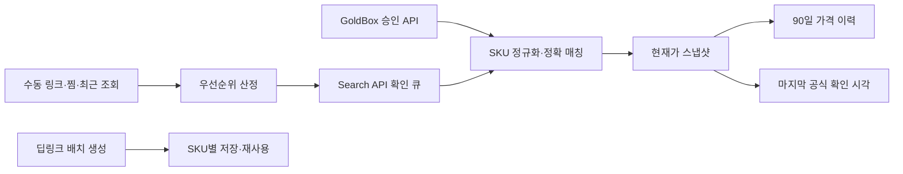
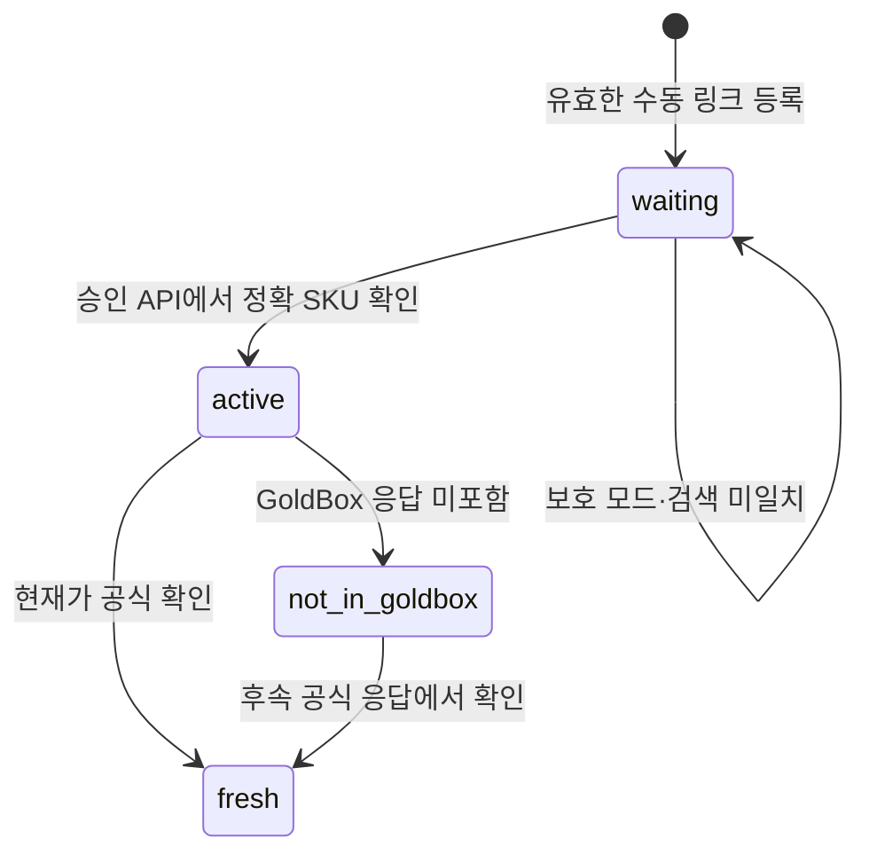

# 가신의 공식 API 기반 가격 갱신 아키텍처 제안

작성일: 2026-08-14  
작성자: Manus AI

## 결론

가신은 현재처럼 **쿠팡 파트너스의 승인된 GoldBox·상품 검색·딥링크 기능만 사용**하는 범위에서 운영하는 것이 적절합니다. 다만 GoldBox에 포함되지 않는 일반 수동 등록 상품은, 표준 Search API만으로 “모든 상품을 매시간 정확히 갱신”하는 서비스 수준을 약속할 수 없습니다. Search API를 실시간 조회 장치가 아니라 **희소한 확인 토큰**으로 취급하고, GoldBox는 대량 갱신 소스, Search API는 고수요·미확인 상품을 위한 보완 소스로 분리해야 합니다.

쿠팡의 일반 Open API는 WING 판매자 계정 기반의 상품 등록·조회·수정과 주문·정산 운영을 위한 API입니다. 문서상 상품 API의 가격 관련 기능도 판매자 운영 상품의 관리 맥락에 있으므로, 임의의 파트너스 링크 상품의 공개 판매가를 추적하는 대체 데이터 소스로 전용해서는 안 됩니다.[1] [2]

> **운영 원칙:** 공식 API가 확인한 가격만 저장하고, 확인하지 못한 상품에는 마지막 공식 확인 시각과 보류 상태를 보여줍니다. 가격이 없을 때 추정가를 표시하거나, 웹·앱 내부 요청을 분석해 호출하지 않습니다.

## 선택 가능한 운영 모델

| 접근 방식 | 작동 방식 | 장점 | 제약 | 설정 복잡도 |
|---|---|---|---|---|
| **A. GoldBox 중심 + 제한적 Search 보완** | GoldBox 응답으로 대량 갱신하고, 남은 Search 예산을 수동 등록·찜·최근 조회 상품의 확인 큐에 배정 | 현재 가신 구조를 그대로 확장할 수 있고, 즉시 적용 가능 | GoldBox 외 일반 상품의 최신성은 상품별로 다름 | 낮음 |
| **B. 공식 데이터 제공·제휴 확대** | 쿠팡 담당 채널을 통해 상품 가격 피드, 상품 단건·일괄 조회 권한 또는 별도 쿼터를 공식 확인·계약 | 대량 목록을 안정적으로 갱신할 수 있는 유일한 확장 경로 | 계약·승인·비용 조건이 필요할 수 있음 | 중간~높음 |
| **C. 자사 판매 상품 전용 운영 API 병행** | 사용자가 직접 판매하는 WING 상품만 판매자 Open API로 관리하고, 파트너스 추적 상품은 A 또는 B로 운영 | 자사 상품의 재고·가격·옵션 관리를 분리할 수 있음 | 제3자·일반 쿠팡 상품의 가격 추적 대안은 아님 | 중간 |

가신의 현 단계에는 **A를 기본으로 적용하고, 목록 규모나 갱신 정확도 요구가 커지면 B를 검토**하는 순서가 가장 현실적입니다. C는 사용자가 판매자이면서 자신의 판매 상품을 별도로 관리할 필요가 있는 경우에만 의미가 있습니다.

## 권고안: 3계층 갱신 파이프라인

### 1. 대량 갱신 계층: GoldBox

GoldBox API 응답을 12시간마다 수집해 신규 후보와 현재가를 저장하고, 1시간 가격 작업에서는 DB에 있는 GoldBox 출처 상품 중 우선순위가 높은 SKU를 먼저 매칭합니다. 이 작업은 하나의 승인된 응답에서 여러 등록 상품을 함께 갱신할 수 있어, 호출 효율이 가장 높습니다.

GoldBox 응답에 포함되지 않는 상품은 실패로 표시하지 않습니다. 대신 ‘이번 GoldBox 응답에서 미확인’이라는 상태만 기록합니다. GoldBox는 전체 카탈로그가 아니라 프로모션 목록이므로, 미포함은 가격 변동 없음이나 판매 종료를 뜻하지 않습니다.

### 2. 제한 확인 계층: Search API 토큰 큐

현재 가신의 내부 상한은 **시간당 8회와 요청 사이 8분 쿨다운**입니다. 이 값은 시간당 10회라는 외부 한도에 여유를 남기기 위한 안전 장치입니다. 각 호출은 제품 목록 전체가 아니라 하나의 정규화된 검색어에 대한 결과를 반환하므로, 토큰은 다음 순서로 배정합니다.

| 우선순위 | 후보 조건 | 갱신 목표 | 재시도 기준 |
|---|---|---|---|
| 높음 | 찜한 상품, 최근 상세 조회, 새 수동 등록 후 미확인, 사용자가 명시적으로 확인 요청 | 다음 사용 가능한 안전 토큰 | 정확 SKU 미발견 시 대기 유지 |
| 보통 | 최근 7일 내 조회된 일반 수동 등록 상품 | 마지막 확인 시각 갱신 | 일정 간격 후 재후보화 |
| 낮음 | 장기간 미조회·미찜 상품 | 주기적 샘플 확인만 수행 | 예산 여유가 있을 때만 처리 |

한 검색 결과에서 DB에 저장된 `productId + itemId + vendorItemId` 조합이 정확히 일치하는 옵션만 갱신합니다. 상품명·이미지·가격이 유사하다는 이유만으로 다른 옵션이나 다른 판매자의 가격을 덮어쓰지 않습니다. 정확한 SKU를 찾지 못하면 가격 스냅샷을 만들지 않고, 검색어·시도 시각·미발견 사유만 실행 로그에 남깁니다.

### 3. 사용자 신뢰 계층: 신선도 상태 공개

일반 수동 등록 상품에는 다음 필드를 별도로 저장·표시합니다. 이는 데이터 부족을 감추는 기능이 아니라, 사용자에게 가격의 근거와 최신성을 명확하게 알리는 장치입니다.

| 필드 | 의미 | 화면 표기 예시 |
|---|---|---|
| `lastOfficialCheckedAt` | 승인 API에서 SKU 가격을 마지막으로 확인한 시각 | `공식 확인: 2026-08-14 17:00` |
| `refreshState` | `fresh`, `waiting`, `not_in_goldbox`, `rate_limited`, `unmatched` 등 | `다음 안전 조회 대기` |
| `nextEligibleCheckAt` | 큐에 다시 들어갈 수 있는 가장 이른 시각 | `다음 확인 후보: 약 19:00 이후` |
| `lastRefreshReason` | 갱신 또는 보류 사유 | `GoldBox 미포함 / 검색 결과 미일치` |

가격 알림 기능을 추가할 때도 `lastOfficialCheckedAt`이 정해진 신선도 기준을 만족하는 상품만 알림 후보로 삼아야 합니다. 예를 들어 오래된 가격을 기준으로 ‘가격 하락’ 알림을 보내면 사용자가 실제 가격과 다른 정보를 받을 수 있습니다.

## 수동 등록 상품의 상태 전이

수동 링크가 입력되면 URL에서 안전한 상품 식별자를 뽑아 DB에 저장합니다. 이미 알려진 SKU와 연결되면 즉시 활성화하며, 해당 SKU는 고우선 후보가 됩니다. 연결되지 않은 유효 링크는 `waiting`으로 보관하며, 후속 Search API 토큰 또는 GoldBox 응답에서 정확한 SKU가 확인될 때 활성화합니다.

‘검색 결과 미일치’는 링크가 잘못되었다는 증거가 아닙니다. 따라서 유효한 링크를 자동 거절하지 않고, 대기 상태와 재시도 사유를 유지하는 것이 안전합니다. 영구 거절은 URL 검증 실패처럼 등록 시점에 객관적으로 확인 가능한 경우에 한정하는 편이 낫습니다.

## 운영 흐름과 실패 처리

정기 작업은 1시간 단위의 가격 확인, 12시간 단위의 GoldBox 수집, 하루 1회의 90일 초과 가격 이력 정리를 유지합니다. 시간 단위 작업은 결정적 API 호출·DB 저장만 수행하므로 백그라운드 정기 작업으로 실행합니다. 외부 API가 403 보호 상태를 반환하면 모든 쿠팡 호출을 중단하고, 작업은 외부 호출 없이 성공 스킵으로 기록합니다. 보호 해제 시각 전에는 재시도하지 않습니다.

Search API 토큰을 놓고 사용자 검색과 정기 갱신이 경쟁하지 않도록, 하나의 전역 토큰 장부를 공유해야 합니다. 예를 들어 사용자 검색이 토큰을 사용했다면, 그 시각의 정기 갱신은 대기열에서 다음 후보로 미뤄야 합니다. 반대로 정기 갱신이 토큰을 사용했더라도 사용자의 요청을 강제로 실패시키지 말고, DB 캐시 결과와 다음 가능 시각을 함께 보여주는 편이 좋습니다.

## 구현 우선순위

| 단계 | 추가 내용 | 기대 효과 |
|---|---|---|
| 1 | 일반 수동 등록 상품에 `lastOfficialCheckedAt`, `refreshState`, `nextEligibleCheckAt`, `lastRefreshReason` 저장 | 가격 최신성과 보류 이유를 투명하게 표시 |
| 2 | Search 예산의 공용 토큰 큐와 `high/normal/low` 후보 스케줄러 추가 | 찜·최근 조회·수동 등록 상품에 제한된 예산 집중 |
| 3 | 검색 결과의 정확 SKU 매칭 실패 로그와 재후보화 규칙 추가 | 오매칭 방지와 운영 관측성 향상 |
| 4 | 상품 상세의 ‘가격 확인 요청’ 버튼을 대기열에 연결 | 실제 수요에 따라 예산을 배분 |
| 5 | 쿠팡에 공식 가격 피드·상품 단건/일괄 조회·쿼터 상향 가능 여부 문의 | 대량·정기 갱신의 확장 가능성 판단 |

## 확인이 필요한 공식 협의 항목

쿠팡 파트너스 지원 채널에 다음을 명확히 문의한 뒤, 기능 제공이 문서와 계약으로 확인된 경우에만 연동해야 합니다. CPI 공식 문서 사이트는 API 문서와 지원 연락처를 제공하고 있습니다.[3]

1. 파트너스 계정에 대해 `productId`, `itemId`, `vendorItemId` 기준의 상품 단건 가격 조회 또는 다건 가격 조회 기능이 제공되는지 확인합니다.
2. 일반 공개 상품의 가격·배송·옵션 정보를 정기적으로 받을 수 있는 공식 피드 또는 미디어 제휴 프로그램이 있는지 확인합니다.
3. Search API의 계약상 호출 한도, 403 보호 정책, 스케줄링 허용 범위와 공식적인 쿼터 상향 절차를 확인합니다.
4. GoldBox 이외의 프로모션·기획전·카테고리 데이터가 파트너스 계정에 공식 제공되는지, 제공된다면 가격 갱신 목적으로 저장 가능한지 확인합니다.

## 참고문헌

[1] [Coupang Open API 안내 — Coupang Developer Center](https://developers.coupang.com/ko/getting-started/coupang-open-api)

[2] [Coupang Open API 문서 — Coupang Developer Center](https://developers.coupang.com/ko/api)

[3] [CPI API Docs — Coupang Partner Integration](https://partner-developers.coupangcorp.com/hc/ko/categories/360005470572-API-Docs)
